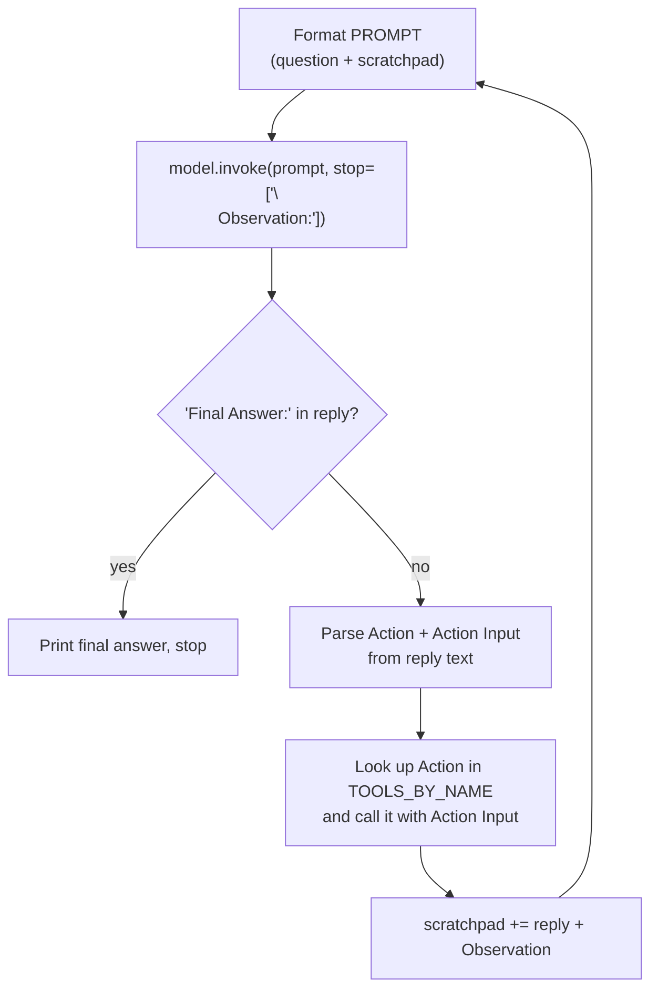

# 🦜 LangChain-In-Depth

A hands-on learning repository for **LangChain**, working up from chat models and LCEL chains to retrieval-augmented generation (RAG) and tool-calling agents.

> **Perfect for**: developers learning LangChain step by step, using each script as a standalone reference for one concept.

---

## 📚 Overview

Ten standalone, runnable scripts, each isolating one concept:

| Script | Concept |
|---|---|
| [main.py](main.py) | Chat models, prompt templates, multi-turn conversation, first LCEL chain |
| [rag-tooling.py](rag-tooling.py) | RAG chain *shape* using a fake in-memory retriever (no API calls for retrieval) |
| [real_rag.py](real_rag.py) | Real RAG: text splitting, OpenAI embeddings, `InMemoryVectorStore` |
| [tool_calling.py](tool_calling.py) | Tool-calling agent (`create_agent`) with a strict system prompt and free-form output |
| [tool_calling_with_pydantic_schema.py](tool_calling_with_pydantic_schema.py) | Same agent pattern, but with structured Pydantic output (`response_format`) |
| [tool_calling_manual.py](tool_calling_manual.py) | The same job-search agent with `create_agent` removed — the tool-call loop written by hand |
| [teach_tool_calling.py](teach_tool_calling.py) | Minimal, single-tool version of the manual loop — isolates what a `ToolCall` dict is for and why `BaseTool.invoke()` needs the whole thing, not just `args` |
| [tool_calling_manual_pydantic.py](tool_calling_manual_pydantic.py) | Same manual loop, but the tool is a bare Pydantic model, not `@tool` — isolates schema-only binding vs. execution |
| [teach_react_agent.py](teach_react_agent.py) | Minimal single-tool **ReAct** loop — Thought/Action/Action Input/Observation as a text format the model follows, no `bind_tools` involved |
| [agent_loop_with_react_prompt.py](agent_loop_with_react_prompt.py) | ReAct loop extended to a real choice between two tools — the prompt lists tool descriptions, and parsing has to recover both the chosen action *and* its input |

## 📋 Requirements

- **Python 3.10+**
- **[uv](https://docs.astral.sh/uv/)** – fast Python package manager (replaces pip + venv)
- **[OpenAI API key](https://platform.openai.com/api-keys)** – for chat models and embeddings
- **[Tavily API key](https://tavily.com/)** – for web search in the agent examples

Dependency management and locking are handled via `uv` (see [pyproject.toml](pyproject.toml) / [uv.lock](uv.lock)).

---

## 🚀 Quick Start

### 1. Clone the repository

```bash
git clone https://github.com/officialbidisha/Langchain-In-Depth.git
cd Langchain-In-Depth
```

### 2. Install dependencies

```bash
uv sync
```

### 3. Configure API keys

Create a `.env` file in the project root:

```env
OPENAI_API_KEY=sk-your-openai-key-here
TAVILY_API_KEY=your-tavily-api-key-here
```

> ⚠️ **Never commit `.env`** – it's already in `.gitignore`

### 4. Run examples

```bash
uv run python main.py                              # chat models, prompt templates, and LCEL basics
uv run python rag-tooling.py                        # RAG pipeline shape using a mocked retriever
uv run python real_rag.py                           # real RAG: text splitting, embeddings, vector search
uv run python tool_calling.py                       # tool-calling job-search agent (Tavily search + extract)
uv run python tool_calling_with_pydantic_schema.py   # same idea, with structured Pydantic output
uv run python tool_calling_manual.py                 # the create_agent loop, written by hand
uv run python teach_tool_calling.py                  # minimal manual loop: ToolCall shape, tool_call_id matching
uv run python tool_calling_manual_pydantic.py         # same loop, tool defined via bare Pydantic model
uv run python teach_react_agent.py                   # minimal single-tool ReAct loop (Thought/Action/Observation)
uv run python agent_loop_with_react_prompt.py         # ReAct loop choosing between two tools
```

---

## 📁 Project Structure

```
.
├── main.py                              # Chat models, prompts, multi-turn messages, LCEL chains
├── rag-tooling.py                        # RAG chain shape with a fake in-memory retriever
├── real_rag.py                           # RAG with real embeddings and vector store retrieval
├── tool_calling.py                       # Tool-calling agent: searches + verifies job postings
├── tool_calling_with_pydantic_schema.py  # Tool-calling agent with structured (Pydantic) output
├── tool_calling_manual.py                # Same agent, with create_agent's loop written by hand
├── teach_tool_calling.py                 # Minimal manual loop: ToolCall shape, tool_call_id matching
├── tool_calling_manual_pydantic.py       # Same loop, tool schema as a bare Pydantic model (no @tool)
├── teach_react_agent.py                  # Minimal single-tool ReAct loop (Thought/Action/Observation)
├── agent_loop_with_react_prompt.py       # ReAct loop with a real choice between two tools
├── pyproject.toml                        # Project metadata and dependencies
├── uv.lock                               # Locked dependency versions
└── .env                                  # Local environment variables (not committed)
```

---

## 🔍 Example Breakdown

### `main.py` – Foundations
- Initialize a chat model (`ChatOpenAI`)
- Send `SystemMessage` / `HumanMessage` / `AIMessage` for multi-turn conversation
- Build a first LCEL chain: `prompt | model | parser`

### `rag-tooling.py` – RAG shape, no external calls
- A `FakeRetriever` stands in for a real vector store, so the chain's *shape* can be studied without hitting an API
- `RunnableParallel` runs two branches on the same input: one formats retrieved docs into context, the other passes the question through untouched
- The prompt's `{context}` / `{question}` placeholders must match the `RunnableParallel` dict keys exactly, or the chain raises `KeyError` at runtime

### `real_rag.py` – Production RAG
- `RecursiveCharacterTextSplitter` chunks a raw text blob
- `OpenAIEmbeddings` embeds each chunk into `InMemoryVectorStore`
- `vectorstore.as_retriever()` performs real cosine-similarity search
- Same `RunnableParallel → prompt → model → parser` shape as `rag-tooling.py`, now backed by real retrieval

### `tool_calling.py` – Agent with a strict system prompt
- Two tools: `get_jobs` (Tavily search) and `get_job_details` (Tavily `extract`, to pull full posting content)
- `create_agent(model, tools=[...], system_prompt=...)` builds the agent
- The system prompt encodes hard verification rules (explicit LangChain/LangGraph/LangSmith mention, explicit remote status, explicit India eligibility) so the agent can't hedge its way to a target count
- Output is the raw agent message trace, printed via `message.pretty_print()`

### `tool_calling_with_pydantic_schema.py` – Structured output
- Same job-search idea, single `get_new_jobs(query: str)` tool with a free-form query
- `response_format=AgentResponse` (a Pydantic model) makes `create_agent` return `result["structured_response"]` as a typed `AgentResponse` instead of free text
- `Job` / `AgentResponse` Pydantic models define the exact shape (title, company, location, url) the agent must fill in

### `tool_calling_manual.py` – `create_agent`, unwrapped
- Same two tools and equivalent rules as `tool_calling.py`, but no `create_agent` — `model.bind_tools(TOOLS)` plus a hand-written loop
- The loop: call the model → if `response.tool_calls` is non-empty, run each tool and append a `ToolMessage` (matched back via `tool_call_id`) → call the model again → repeat until no tool calls remain
- A `MAX_STEPS` cap guards against the loop never terminating — the same kind of recursion limit `create_agent`/LangGraph applies internally
- Shows exactly what `create_agent` buys you: this version has no built-in `response_format` coercion, streaming, or checkpointing

### `teach_tool_calling.py` – The `ToolCall` shape, isolated
- One tool (`get_new_jobs`), no system prompt engineering — strips away agent behavior to focus purely on the request/execute/respond mechanics
- A single `HumanMessage` produced one `AIMessage` with **4** `tool_calls` (Meta, Google, Salesforce, Uber) — the model batches independent lookups into one turn instead of asking one at a time
- `BaseTool.invoke()` branches on its input's shape (see `_prep_run_args` in `langchain_core/tools/base.py`): pass just `tool_call["args"]` and you get the tool's raw return value; pass the **whole** `tool_call` dict (`{name, args, id, type}`) and it unwraps `args` to run the function, then wraps the output in a `ToolMessage` tagged with `tool_call_id`
- That `tool_call_id` tag is the only thing letting 4 parallel requests in one AI turn get matched back to their 4 correct answers once the message list is sent back to the model
- The `for tool_call in result.tool_calls:` loop that runs the tools is sequential in your code (each Tavily call blocks before the next starts) even though the model's *request* for them was parallel — "parallel in the API's eyes" and "concurrent in your code" are different things

### `tool_calling_manual_pydantic.py` – Schema-only binding, no `@tool`
- `GetNewJobs(BaseModel)` defines only the input schema (fields + docstring) — no function body, no execution logic attached
- `bind_tools([GetNewJobs])` accepts the Pydantic **class** directly; the resulting `result.tool_calls` has the identical `{name, args, id, type}` shape as `teach_tool_calling.py`'s `@tool`-based version — `bind_tools` doesn't care what shape the schema came from
- Because there's no `BaseTool`, there's no `.invoke()` and no automatic `ToolMessage` wrapping — both are written by hand: route `tool_call["name"]` to the real `get_new_jobs()` function, call it with `**tool_call["args"]`, then manually build `ToolMessage(content=..., tool_call_id=tool_call["id"])`
- `get_new_jobs(**tool_args)` (unpack into keyword args) vs. `BaseTool.invoke(tool_call)` (pass the whole dict) look similar but solve opposite problems — a plain function needs args spread across its named parameters; `BaseTool.invoke()` wants one object it can pattern-match on. Same `tool_call`/`tool_args`, opposite calling convention
- Hit the same structural rule OpenAI's API enforces on every manual loop: a `ToolMessage` must directly follow an assistant message containing the matching `tool_calls` id, or the API 400s with `"messages with role 'tool' must be a response to a preceeding message with 'tool_calls'"` — forgetting `messages.append(result)` before appending `ToolMessage`s breaks this

### `teach_react_agent.py` – ReAct, minimal
- No `bind_tools`, no `create_agent` — the model never sees a tool schema at all. Instead, `PROMPT` spells out a text format (`Thought` / `Action` / `Action Input` / `Observation` / `Final Answer`) and the model is expected to follow it literally
- `model.invoke(prompt, stop=["\nObservation:"])` cuts generation off right where the model would otherwise hallucinate its own search result — the real observation has to come from actually running Python code, not from the model's imagination
- The loop: format `PROMPT` with the running `scratchpad` → invoke → if `"Final Answer:"` is in the reply, done → otherwise pull `Action Input` out of the text, call `search_jobs` directly, and append `reply + Observation` onto `scratchpad` so the next prompt includes the full history
- Only one tool exists, so nothing is actually *chosen* yet — parsing only has to recover the input, never the action name



### `agent_loop_with_react_prompt.py` – ReAct, real tool choice
- Two tools this time (`JobSearchTool`, `CompanyInfoTool`), each a Pydantic `BaseModel` used purely to hold a name + description — never bound via `bind_tools`, just read back into the prompt text so the model has something real to choose between
- `TOOLS_BY_NAME` (name → callable, for dispatch) and `TOOLS_DESCRIPTIONS` (name → description, for the prompt) are kept as two separate dicts — dispatch and "what the model gets told" are different concerns and don't belong in the same structure
- `tool_names`/`tools` are built once via `", ".join(...)` / `"\n".join(...)` over `TOOLS_DESCRIPTIONS` and injected into `PROMPT`'s `{tool_names}`/`{tools}` placeholders — the model can only pick a tool it's actually been told about
- Parsing got harder: `Action Input` is still the *last* field before the stop sequence, so `reply.split("Action Input:")[-1].strip()` works unchanged. `Action` is **not** last — `Action Input:` follows it on the next line — so recovering just the action name needs `reply.splitlines()` + `line.startswith("Action:")` to isolate the right line first, then the same split/strip
- Confirmed the model genuinely chooses: given "find a job at Salesforce, then tell me about Salesforce's culture," it called `JobSearchTool`, judged the result insufficient, and switched to `CompanyInfoTool` on its own — driven only by the descriptions in the prompt
- Hand-rolled ReAct has no built-in repetition guard the way `create_agent`'s LangGraph loop does — without one, the model sometimes retried an identical `Action`/`Action Input` pair for several steps, apologizing each time, and ran out of its step budget before reaching `Final Answer`. Fixed with two independent changes: an explicit prompt line ("do not repeat an Action with the same Action Input you've already tried") and raising the step budget from 6 to 10

---

## 📖 Suggested Learning Path

1. **`main.py`** – chat models, messages, first LCEL chain
2. **`rag-tooling.py`** – learn the RAG chain shape with no API cost
3. **`real_rag.py`** – swap the fake retriever for real embeddings + vector search
4. **`tool_calling.py`** – build an agent, see how much a system prompt has to constrain it
5. **`tool_calling_with_pydantic_schema.py`** – same agent, structured output instead of free text
6. **`tool_calling_manual.py`** – strip away `create_agent` and write the tool-call loop yourself, to see what it was doing
7. **`teach_tool_calling.py`** – same loop, minimal single-tool version — the one to reread when the `ToolCall` dict / `tool_call_id` mechanics get fuzzy
8. **`tool_calling_manual_pydantic.py`** – same loop again, but the tool is a bare Pydantic model instead of `@tool` — see what binding buys you (a schema) vs. what it doesn't (execution)
9. **`teach_react_agent.py`** – switch tracks entirely: no `bind_tools`, a text format the model follows instead — see the ReAct loop mechanics with just one tool
10. **`agent_loop_with_react_prompt.py`** – same ReAct loop with two tools — see the model actually choose, and see what breaks (and how to fix it) once there's a real choice to parse

---

## 💡 Learnings

Notes from building the tool-calling agents — things that weren't obvious going in:

- **Check the real SDK before wiring a tool to it.** `tavily-python`'s `TavilyClient` only exposes `search`, `extract`, `crawl`, `map`, etc. — there's no `get_job_details` method, so a tool calling it would fail at runtime the moment the agent tried to use it. Use `tavily.extract(url)` to pull full content from a specific posting instead.
- **`create_agent`'s real kwargs**: it's `response_format` (not `response_schema`) for structured output, and `.invoke()` expects `{"messages": [...]}`, not a bare string.
- **Agents under-explore by default.** Given 10+ search results and a budget of 5 verified jobs, `gpt-4o-mini` would check just the *first* candidate, get one hit, and stop — instead of working through the list. The system prompt has to explicitly say "keep going through remaining candidates" and "search again with a different query if you're short," or the agent quits early.
- **Agents will rationalize instead of exclude.** Once told to return "up to five," the model padded to five by hedging: labeling an on-site job "remote (but listed on-site)," or justifying weak evidence with "may include LangChain." Prompts need to state exclusion as the default and explicitly ban hedging language, or the LLM will bend the rules to hit the target count.
- **Model choice affects rule-following, not just quality.** Swapping `gpt-4o-mini` → `gpt-4o` measurably improved compliance (it correctly dropped an on-site job the mini model kept) — worth testing on a stricter model before assuming a prompt is broken.
- **Give tools a query the agent can actually use.** A tool with a single `location: str` parameter can't express "software engineer roles at Meta, Google, Salesforce, Uber" — the agent ended up calling it 4 times with the exact same input, unable to encode what it actually wanted. A free-form `query: str` parameter let it compose the real intent in one call.
- **VS Code's Python interpreter is separate from the project's `.venv`.** Imports that work fine via `uv run` can still fail in the IDE if `python.defaultInterpreterPath` isn't pointed at `.venv/bin/python` (see `.vscode/settings.json`).
- **`create_agent`'s tool loop, unwrapped, is just**: bind tools → invoke → if `response.tool_calls`, run each and append a `ToolMessage` keyed by `tool_call_id` → invoke again → repeat until no tool calls remain (see `tool_calling_manual.py`). What it hides is `response_format` coercion, streaming, and the LangGraph state graph/checkpointing underneath.
- **`BaseTool.invoke()` reads its input's *shape* to decide what to do.** Pass a plain dict of args (`{'query': ..., 'search_depth': ...}`) and it runs the tool, returning the raw output. Pass a full `ToolCall` dict (`{'name', 'args', 'id', 'type': 'tool_call'}`) and it detects that shape, uses `args` to run the function, but wraps the return value in a `ToolMessage` carrying `tool_call_id`. There's no separate "tool call mode" flag — it's purely inferred from the keys present in the input (`teach_tool_calling.py`).
- **`.invoke(**kwargs)` isn't a thing for `BaseTool`.** Its signature takes one positional `input` (str, dict, or `ToolCall`) — unpacking args as `.invoke(**tool_args)` throws `TypeError: missing 1 required positional argument: 'input'`. Pass the dict itself, not its unpacked keys.
- **`bind_tools` only cares about producing valid `tool_calls` — not what defined the schema.** A bare Pydantic class (no `@tool`) binds and produces `tool_calls` with the exact same `{name, args, id, type}` shape as a decorated function. Execution is always on you; `@tool` just also hands you a convenient `.invoke()` to do it with (`tool_calling_manual_pydantic.py`).
- **Plain functions and `BaseTool` want opposite calling conventions for the same data.** A raw Python function needs its args dict *spread*: `get_new_jobs(**tool_args)`. `BaseTool.invoke()` wants the *whole* `tool_call` dict as one object so it can pattern-match on it internally. Passing a spread dict to `invoke()`, or an unspread dict to a plain function, both fail — just with different errors (`TypeError` vs. a 422 from the API receiving a dict where a string was expected).
- **OpenAI's "tool must follow tool_calls" rule is a bracket-matching check.** An assistant message with `tool_calls` is the opening bracket for each call id; a `ToolMessage` is the closing bracket. Every manual loop needs `messages.append(result)` (the AIMessage) *before* appending any `ToolMessage`s, or the API 400s on the first tool message it can't match to a preceding open.
- **ReAct doesn't need `bind_tools` at all.** A plain text format (`Thought`/`Action`/`Action Input`/`Observation`) plus a `stop` sequence plus string parsing reproduces the same request → execute → respond loop as the tool-calling scripts — just driven by string ops on raw text instead of a structured `tool_calls` list.
- **The `stop` sequence is what keeps a ReAct loop honest.** `model.invoke(prompt, stop=["\nObservation:"])` cuts generation off before the model can write its own fake result. Skip it, and the model happily hallucinates a plausible-looking `Observation:` instead of waiting for the real one.
- **Pydantic v2 model fields don't exist at the class level.** `MyModel.some_field` raises `AttributeError` even when `some_field` has a `default=` — fields are per-instance data, full stop. To read a field's default (or its `description=`, type, etc.) without instantiating, use `MyModel.model_fields["some_field"].default` — `model_fields` is a dict of `FieldInfo` objects, always available on the class itself.
- **`ClassVar` is the escape hatch for a genuinely class-level attribute on a `BaseModel`.** `description: ClassVar[str] = "..."` tells Pydantic "don't manage this as a field" — it becomes a normal Python class attribute, readable directly off the class (`MyModel.description`), no instance or `model_fields` lookup needed.
- **Where a field sits in the text format changes how you parse it.** The *last* field before a `stop` sequence (`Action Input`) can be extracted with `reply.split(label)[-1].strip()` since nothing trails it. A field with something after it on the next line (`Action`, followed by `Action Input`) needs isolating to its own line first (`reply.splitlines()` + `line.startswith(label)`) before the same split/strip — grabbing everything after the label directly would swallow the next field too.
- **Hand-rolled ReAct loops have no built-in repetition guard.** Unlike `create_agent`'s LangGraph state machine, nothing stops the model from retrying an identical `Action`/`Action Input` pair forever if a search comes back thin — it'll apologize and retry until the step budget runs out. Needs to be handled explicitly: an instruction in the prompt against repeating a tried action, and/or a larger step budget as a backstop.

---

## 🗒️ Notes for Tomorrow

A living list, not a daily log — check items off or remove them as they're done instead of re-queuing under a new date.

**Next up**
- [ ] **Add structured output by hand** to `tool_calling_manual.py` and `tool_calling_manual_pydantic.py` — once each loop ends, pass the final answer through `model.with_structured_output(AgentResponse)` (or a second call) and compare to what `response_format=` does automatically in `tool_calling_with_pydantic_schema.py`.
- [ ] **Make the manual tool-call loops actually concurrent** — every `for tool_call in result.tool_calls:` loop so far runs its Tavily searches sequentially even though the model's request for them was parallel; try `asyncio.gather` (with `.ainvoke`) or a thread pool and compare wall-clock time against the sequential version.
- [ ] **Mix an `@tool` function and a bare Pydantic model in the same `bind_tools([...])` call** — confirm the model can request either shape of tool call in one turn, and that dispatch-by-`tool_name` handles both without special-casing.
- [ ] **Read the LangGraph basics** — `create_agent` is a thin wrapper around a LangGraph `StateGraph`. Understanding nodes/edges/state directly will explain *why* the loop, message list, and stopping condition look the way they do.
- [ ] **Add streaming** — swap `.invoke(...)` for `.stream(...)` in `tool_calling_manual.py` and print tokens as they arrive; note what has to change to still detect `tool_calls`.
- [ ] **Re-run `tool_calling.py` on `gpt-4o-mini`** and diff the results against `gpt-4o` to see the rule-following gap firsthand (see Learnings above).
- [ ] **Skim LangChain's own agent docs** on memory/checkpointing — `create_agent` supports persisting state across runs; the manual versions currently don't.
- [ ] **Compare the ReAct loop against the `bind_tools` loop head-to-head** — same job-search task through both `agent_loop_with_react_prompt.py` and `tool_calling_manual.py`, and note the real tradeoffs (structured `tool_calls` vs. fragile text parsing; prompt-format compliance vs. schema validation).
- [ ] **Add a code-level repetition guard to the ReAct loop**, not just a prompt instruction — track seen `(action, action_input)` pairs and short-circuit or force a different approach if the model repeats one, instead of relying on it to follow the "don't repeat" instruction on its own.

**Done**
- [x] **Parallel tool calls** — confirmed in `teach_tool_calling.py`: one `HumanMessage` produced a single `AIMessage` with 4 `tool_calls` (Meta/Google/Salesforce/Uber), and the manual loop resolved all 4 correctly, matched back via `tool_call_id`.
- [x] **Stage 1 of `tool_calling_manual_pydantic.py`** — same manual bind-tools loop as `teach_tool_calling.py`, tool schema defined as a bare Pydantic model instead of via `@tool`; confirmed `bind_tools` produces an identical `tool_calls` shape either way, and that execution/`ToolMessage`-wrapping has to be written by hand without a `BaseTool`.
- [x] **`teach_react_agent.py`** — minimal single-tool ReAct loop built and confirmed working: text-format prompting + `stop=["\nObservation:"]` + string parsing, no `bind_tools` involved.
- [x] **`agent_loop_with_react_prompt.py`** — extended ReAct to a real two-tool choice: dynamic `{tools}`/`{tool_names}` prompt building, two-stage parsing (action name + action input), Pydantic class-vs-instance field access (`model_fields`), and a repetition guard (prompt instruction + larger step budget) after the model got stuck re-trying the same search.

---

## 🐛 Troubleshooting

| Issue | Solution |
|-------|----------|
| `ModuleNotFoundError` | Run `uv sync` to ensure all dependencies are installed |
| `API key not found` | Check `.env` exists in the project root with `OPENAI_API_KEY` and `TAVILY_API_KEY` |
| `KeyError` in a RAG chain | Make sure the prompt's placeholders match the `RunnableParallel` dict keys exactly |
| Agent returns too few / hedged results | Tighten the system prompt's exclusion rules, or try a stronger model (see Learnings above) |

---

## 🔗 Resources

- [LangChain Documentation](https://python.langchain.com/)
- [LCEL Guide](https://python.langchain.com/docs/expression_language/)
- [Agents Documentation](https://python.langchain.com/docs/modules/agents/)
- [OpenAI API Reference](https://platform.openai.com/docs/api-reference)
- [Tavily API Reference](https://docs.tavily.com/)

---

## 📝 License

Distributed under the terms of the [LICENSE](LICENSE) file included in this repository.
