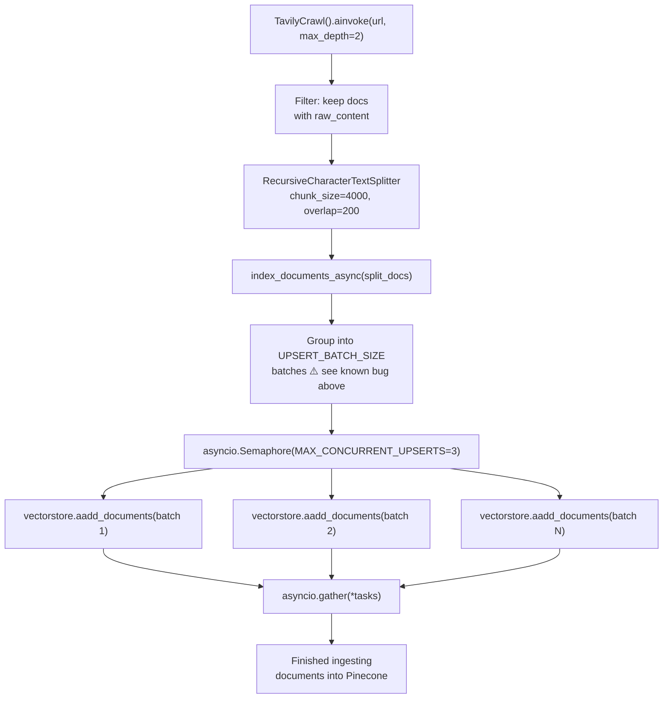
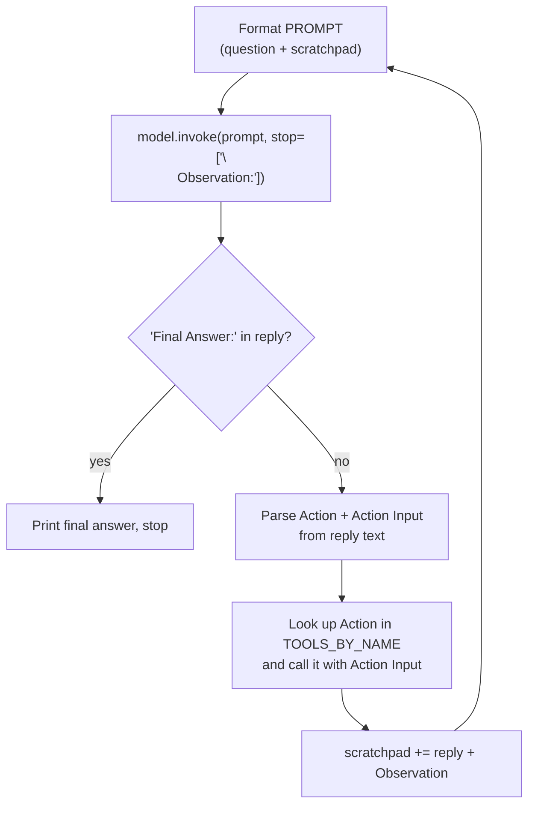

<a id="readme-top"></a>

<p align="center">
  
</p>

<div align="center">

<em>A hands-on learning repo for <b>LangChain</b> — from chat models and LCEL chains to retrieval-augmented generation (RAG) and tool-calling agents, one concept per script.</em>

<br /><br />

[](LICENSE)
[](https://www.python.org/)
[](https://docs.astral.sh/uv/)
[](https://python.langchain.com/)
[](#notes-for-tomorrow)

<br />

[](https://platform.openai.com/)
[](https://tavily.com/)
[](https://www.pinecone.io/)
[](https://docs.pydantic.dev/)
[](https://mermaid.js.org/)

</div>

> [!TIP]
> **Perfect for:** developers learning LangChain step by step — each script is a standalone reference for exactly one concept.

---

<details>
<summary><b>📋 Table of Contents</b></summary>

1. [Overview](#overview)
2. [Requirements](#requirements)
3. [Quick Start](#quick-start)
4. [Project Structure](#project-structure)
5. [Example Breakdown](#example-breakdown)
   - [`main.py`](#main-py) – Foundations
   - [`rag-tooling.py`](#rag-tooling-py) – RAG shape, no external calls
   - [`real_rag.py`](#real-rag-py) – Production RAG
   - [`ingestion.py`](#ingestion-py) – Persistent RAG ingestion pipeline
   - [`tool_calling.py`](#tool-calling-py) – Agent with a strict system prompt
   - [`tool_calling_with_pydantic_schema.py`](#tool-calling-with-pydantic-schema-py) – Structured output
   - [`tool_calling_manual.py`](#tool-calling-manual-py) – `create_agent`, unwrapped
   - [`teach_tool_calling.py`](#teach-tool-calling-py) – The `ToolCall` shape, isolated
   - [`tool_calling_manual_pydantic.py`](#tool-calling-manual-pydantic-py) – Schema-only binding, no `@tool`
   - [`teach_react_agent.py`](#teach-react-agent-py) – ReAct, minimal
   - [`agent_loop_with_react_prompt.py`](#agent-loop-with-react-prompt-py) – ReAct, real tool choice
6. [Suggested Learning Path](#learning-path)
7. [Learnings](#learnings)
8. [Notes for Tomorrow](#notes-for-tomorrow)
9. [Troubleshooting](#troubleshooting)
10. [Resources](#resources)
11. [License](#license)

</details>

---

<a id="overview"></a>

## 📚 Overview

Eleven standalone, runnable scripts, each isolating one concept:

| Script | Concept |
|---|---|
| [main.py](main.py) | Chat models, prompt templates, multi-turn conversation, first LCEL chain |
| [rag-tooling.py](rag-tooling.py) | RAG chain *shape* using a fake in-memory retriever (no API calls for retrieval) |
| [real_rag.py](real_rag.py) | Real RAG: text splitting, OpenAI embeddings, `InMemoryVectorStore` |
| [ingestion.py](ingestion.py) | Persistent RAG ingestion pipeline: crawl real docs with Tavily, chunk, embed, and upsert into a Pinecone index |
| [tool_calling.py](tool_calling.py) | Tool-calling agent (`create_agent`) with a strict system prompt and free-form output |
| [tool_calling_with_pydantic_schema.py](tool_calling_with_pydantic_schema.py) | Same agent pattern, but with structured Pydantic output (`response_format`) |
| [tool_calling_manual.py](tool_calling_manual.py) | The same job-search agent with `create_agent` removed — the tool-call loop written by hand |
| [teach_tool_calling.py](teach_tool_calling.py) | Minimal, single-tool version of the manual loop — isolates what a `ToolCall` dict is for and why `BaseTool.invoke()` needs the whole thing, not just `args` |
| [tool_calling_manual_pydantic.py](tool_calling_manual_pydantic.py) | Same manual loop, but the tool is a bare Pydantic model, not `@tool` — isolates schema-only binding vs. execution |
| [teach_react_agent.py](teach_react_agent.py) | Minimal single-tool **ReAct** loop — Thought/Action/Action Input/Observation as a text format the model follows, no `bind_tools` involved |
| [agent_loop_with_react_prompt.py](agent_loop_with_react_prompt.py) | ReAct loop extended to a real choice between two tools — the prompt lists tool descriptions, and parsing has to recover both the chosen action *and* its input |

<p align="right">(<a href="#readme-top">back to top</a>)</p>

---

<a id="requirements"></a>

## 📋 Requirements

- **Python 3.10+**
- **[uv](https://docs.astral.sh/uv/)** – fast Python package manager (replaces pip + venv)
- **[OpenAI API key](https://platform.openai.com/api-keys)** – for chat models and embeddings
- **[Tavily API key](https://tavily.com/)** – for web search in the agent examples, and web crawling in `ingestion.py`
- **[Pinecone API key](https://www.pinecone.io/)** – for the persistent vector index used by `ingestion.py`

Dependency management and locking are handled via `uv` (see [pyproject.toml](pyproject.toml) / [uv.lock](uv.lock)).

<p align="right">(<a href="#readme-top">back to top</a>)</p>

---

<a id="quick-start"></a>

## 🚀 Quick Start

### 1. Clone the repository

```bash
git clone https://github.com/officialbidisha/Langchain-In-Depth.git
cd Langchain-In-Depth
```

### 2. Install dependencies

```bash
uv sync
```

### 3. Configure API keys

Create a `.env` file in the project root:

```env
OPENAI_API_KEY=sk-your-openai-key-here
TAVILY_API_KEY=your-tavily-api-key-here
PINECONE_API_KEY=your-pinecone-api-key-here
```

> [!WARNING]
> Never commit `.env` — it's already in `.gitignore`.

### 4. Run examples

```bash
uv run python main.py                              # chat models, prompt templates, and LCEL basics
uv run python rag-tooling.py                        # RAG pipeline shape using a mocked retriever
uv run python real_rag.py                           # real RAG: text splitting, embeddings, vector search
uv run python ingestion.py                          # crawl docs.langchain.com, chunk, embed, concurrently upsert into Pinecone (async)
uv run python tool_calling.py                       # tool-calling job-search agent (Tavily search + extract)
uv run python tool_calling_with_pydantic_schema.py   # same idea, with structured Pydantic output
uv run python tool_calling_manual.py                 # the create_agent loop, written by hand
uv run python teach_tool_calling.py                  # minimal manual loop: ToolCall shape, tool_call_id matching
uv run python tool_calling_manual_pydantic.py         # same loop, tool defined via bare Pydantic model
uv run python teach_react_agent.py                   # minimal single-tool ReAct loop (Thought/Action/Observation)
uv run python agent_loop_with_react_prompt.py         # ReAct loop choosing between two tools
```

<p align="right">(<a href="#readme-top">back to top</a>)</p>

---

<a id="project-structure"></a>

## 📁 Project Structure

```
.
├── main.py                              # Chat models, prompts, multi-turn messages, LCEL chains
├── rag-tooling.py                        # RAG chain shape with a fake in-memory retriever
├── real_rag.py                           # RAG with real embeddings and vector store retrieval
├── ingestion.py                          # Crawl, chunk, embed, and upsert docs into a Pinecone index
├── tool_calling.py                       # Tool-calling agent: searches + verifies job postings
├── tool_calling_with_pydantic_schema.py  # Tool-calling agent with structured (Pydantic) output
├── tool_calling_manual.py                # Same agent, with create_agent's loop written by hand
├── teach_tool_calling.py                 # Minimal manual loop: ToolCall shape, tool_call_id matching
├── tool_calling_manual_pydantic.py       # Same loop, tool schema as a bare Pydantic model (no @tool)
├── teach_react_agent.py                  # Minimal single-tool ReAct loop (Thought/Action/Observation)
├── agent_loop_with_react_prompt.py       # ReAct loop with a real choice between two tools
├── pyproject.toml                        # Project metadata and dependencies
├── uv.lock                               # Locked dependency versions
└── .env                                  # Local environment variables (not committed)
```

<p align="right">(<a href="#readme-top">back to top</a>)</p>

---

<a id="example-breakdown"></a>

## 🔍 Example Breakdown

Each script below is collapsed by default — click a summary line to expand its walkthrough.

> [!CAUTION]
> `ingestion.py` has an open batching bug that causes duplicate Pinecone upserts — expanded by default below. See [Notes for Tomorrow](#notes-for-tomorrow).

<a id="main-py"></a>
<details>
<summary><code>main.py</code> – Foundations</summary>

- Initialize a chat model (`ChatOpenAI`)
- Send `SystemMessage` / `HumanMessage` / `AIMessage` for multi-turn conversation
- Build a first LCEL chain: `prompt | model | parser`

</details>

<a id="rag-tooling-py"></a>
<details>
<summary><code>rag-tooling.py</code> – RAG shape, no external calls</summary>

- A `FakeRetriever` stands in for a real vector store, so the chain's *shape* can be studied without hitting an API
- `RunnableParallel` runs two branches on the same input: one formats retrieved docs into context, the other passes the question through untouched
- The prompt's `{context}` / `{question}` placeholders must match the `RunnableParallel` dict keys exactly, or the chain raises `KeyError` at runtime

</details>

<a id="real-rag-py"></a>
<details>
<summary><code>real_rag.py</code> – Production RAG</summary>

- `RecursiveCharacterTextSplitter` chunks a raw text blob
- `OpenAIEmbeddings` embeds each chunk into `InMemoryVectorStore`
- `vectorstore.as_retriever()` performs real cosine-similarity search
- Same `RunnableParallel → prompt → model → parser` shape as `rag-tooling.py`, now backed by real retrieval

</details>

<a id="ingestion-py"></a>
<details open>
<summary><code>ingestion.py</code> – Persistent RAG ingestion pipeline</summary>

- Five-stage pipeline: **Crawl → Extract → Chunk → Embed → Upsert** — a one-time/periodic batch job, entirely separate from any script that later *queries* the index
- The whole script is async now: `main()` and `index_documents_async()` are both `async def`, driven by a single `asyncio.run(main())` at the bottom
- `TavilyCrawl().ainvoke({...})` does a BFS-style crawl from a root URL (`max_depth` = link-hops from root) and returns extracted page content per URL — no separate scraping code needed
- `TavilyCrawl` has `handle_tool_error=True` by default: on an internal failure it returns the error as a plain **string** instead of raising, so `res["results"]` must be guarded with `isinstance(res, dict)` or a transient failure surfaces as a confusing `TypeError: string indices must be integers` instead of the real error message
- Not every crawled URL yields `raw_content` (redirects, non-HTML assets, failed extraction can return `None`) — `Document(page_content=None)` raises a pydantic `ValidationError`, so results are filtered with `if doc.get("raw_content")` before building `Document`s
- `RecursiveCharacterTextSplitter(chunk_size=4000, chunk_overlap=200)` splits each page; `split_documents` (as opposed to `split_text`) also propagates each chunk's `metadata={"source": url}` forward, which is what lets a later retriever cite which page an answer came from
- `OpenAIEmbeddings(model="text-embedding-3-large", dimensions=1024)` — `text-embedding-3-large` natively outputs 3072-dim vectors, but OpenAI v3 embedding models support Matryoshka-style truncation via `dimensions=`. It's pinned to 1024 here because Pinecone indexes have a **fixed** dimension set at creation time, and `langchain-doc-index` was created as a Pinecone-integrated-inference index (bound to `llama-text-embed-v2`, 1024-dim) — the embedding model has to match the index, not the other way around
- `embeddings`' own `chunk_size=50` is unrelated to the text splitter's `chunk_size=4000` — it's how many texts get batched into one OpenAI embeddings API call (throughput vs. rate-limit tradeoff), not a text length. Two different "chunk sizes" a few lines apart, easy to conflate
- `index_documents_async()` splits `split_docs` into `UPSERT_BATCH_SIZE`-sized groups, then fires off one `vectorstore.aadd_documents(batch)` task per group through `asyncio.gather(*tasks)` — batches upsert concurrently instead of one at a time
- An `asyncio.Semaphore(MAX_CONCURRENT_UPSERTS)` wraps each `upsert_batch` coroutine, so all batches are *created* up front but only `MAX_CONCURRENT_UPSERTS` (3) run against Pinecone at once — the rest wait on the semaphore before starting
- Each batch's `aadd_documents` call is wrapped in its own `try/except`, so one failed batch is logged and skipped instead of `asyncio.gather` aborting every other in-flight batch
- ⚠️ **Known bug**: the batch-building loop is `for i in range(0, len(documents)): batches.append(documents[i:i+UPSERT_BATCH_SIZE])` — missing the `UPSERT_BATCH_SIZE` step argument that the pre-async version had (`range(0, len(split_docs), UPSERT_BATCH_SIZE)`). With the default step of 1, `i` advances one document at a time, so batches are a 100-wide *sliding window* instead of 100 disjoint groups — every chunk gets upserted up to 100 times. See [Notes for Tomorrow](#notes-for-tomorrow).
- No explicit `ids` are passed to `aadd_documents` either, so re-running the script against the same URLs inserts duplicate vectors rather than upserting-in-place — not yet idempotent (see [Notes for Tomorrow](#notes-for-tomorrow))



</details>

<a id="tool-calling-py"></a>
<details>
<summary><code>tool_calling.py</code> – Agent with a strict system prompt</summary>

- Two tools: `get_jobs` (Tavily search) and `get_job_details` (Tavily `extract`, to pull full posting content)
- `create_agent(model, tools=[...], system_prompt=...)` builds the agent
- The system prompt encodes hard verification rules (explicit LangChain/LangGraph/LangSmith mention, explicit remote status, explicit India eligibility) so the agent can't hedge its way to a target count
- Output is the raw agent message trace, printed via `message.pretty_print()`

</details>

<a id="tool-calling-with-pydantic-schema-py"></a>
<details>
<summary><code>tool_calling_with_pydantic_schema.py</code> – Structured output</summary>

- Same job-search idea, single `get_new_jobs(query: str)` tool with a free-form query
- `response_format=AgentResponse` (a Pydantic model) makes `create_agent` return `result["structured_response"]` as a typed `AgentResponse` instead of free text
- `Job` / `AgentResponse` Pydantic models define the exact shape (title, company, location, url) the agent must fill in

</details>

<a id="tool-calling-manual-py"></a>
<details>
<summary><code>tool_calling_manual.py</code> – <code>create_agent</code>, unwrapped</summary>

- Same two tools and equivalent rules as `tool_calling.py`, but no `create_agent` — `model.bind_tools(TOOLS)` plus a hand-written loop
- The loop: call the model → if `response.tool_calls` is non-empty, run each tool and append a `ToolMessage` (matched back via `tool_call_id`) → call the model again → repeat until no tool calls remain
- A `MAX_STEPS` cap guards against the loop never terminating — the same kind of recursion limit `create_agent`/LangGraph applies internally
- Shows exactly what `create_agent` buys you: this version has no built-in `response_format` coercion, streaming, or checkpointing

</details>

<a id="teach-tool-calling-py"></a>
<details>
<summary><code>teach_tool_calling.py</code> – The <code>ToolCall</code> shape, isolated</summary>

- One tool (`get_new_jobs`), no system prompt engineering — strips away agent behavior to focus purely on the request/execute/respond mechanics
- A single `HumanMessage` produced one `AIMessage` with **4** `tool_calls` (Meta, Google, Salesforce, Uber) — the model batches independent lookups into one turn instead of asking one at a time
- `BaseTool.invoke()` branches on its input's shape (see `_prep_run_args` in `langchain_core/tools/base.py`): pass just `tool_call["args"]` and you get the tool's raw return value; pass the **whole** `tool_call` dict (`{name, args, id, type}`) and it unwraps `args` to run the function, then wraps the output in a `ToolMessage` tagged with `tool_call_id`
- That `tool_call_id` tag is the only thing letting 4 parallel requests in one AI turn get matched back to their 4 correct answers once the message list is sent back to the model
- The `for tool_call in result.tool_calls:` loop that runs the tools is sequential in your code (each Tavily call blocks before the next starts) even though the model's *request* for them was parallel — "parallel in the API's eyes" and "concurrent in your code" are different things

</details>

<a id="tool-calling-manual-pydantic-py"></a>
<details>
<summary><code>tool_calling_manual_pydantic.py</code> – Schema-only binding, no <code>@tool</code></summary>

- `GetNewJobs(BaseModel)` defines only the input schema (fields + docstring) — no function body, no execution logic attached
- `bind_tools([GetNewJobs])` accepts the Pydantic **class** directly; the resulting `result.tool_calls` has the identical `{name, args, id, type}` shape as `teach_tool_calling.py`'s `@tool`-based version — `bind_tools` doesn't care what shape the schema came from
- Because there's no `BaseTool`, there's no `.invoke()` and no automatic `ToolMessage` wrapping — both are written by hand: route `tool_call["name"]` to the real `get_new_jobs()` function, call it with `**tool_call["args"]`, then manually build `ToolMessage(content=..., tool_call_id=tool_call["id"])`
- `get_new_jobs(**tool_args)` (unpack into keyword args) vs. `BaseTool.invoke(tool_call)` (pass the whole dict) look similar but solve opposite problems — a plain function needs args spread across its named parameters; `BaseTool.invoke()` wants one object it can pattern-match on. Same `tool_call`/`tool_args`, opposite calling convention
- Hit the same structural rule OpenAI's API enforces on every manual loop: a `ToolMessage` must directly follow an assistant message containing the matching `tool_calls` id, or the API 400s with `"messages with role 'tool' must be a response to a preceeding message with 'tool_calls'"` — forgetting `messages.append(result)` before appending `ToolMessage`s breaks this

</details>

<a id="teach-react-agent-py"></a>
<details>
<summary><code>teach_react_agent.py</code> – ReAct, minimal</summary>

- No `bind_tools`, no `create_agent` — the model never sees a tool schema at all. Instead, `PROMPT` spells out a text format (`Thought` / `Action` / `Action Input` / `Observation` / `Final Answer`) and the model is expected to follow it literally
- `model.invoke(prompt, stop=["\nObservation:"])` cuts generation off right where the model would otherwise hallucinate its own search result — the real observation has to come from actually running Python code, not from the model's imagination
- The loop: format `PROMPT` with the running `scratchpad` → invoke → if `"Final Answer:"` is in the reply, done → otherwise pull `Action Input` out of the text, call `search_jobs` directly, and append `reply + Observation` onto `scratchpad` so the next prompt includes the full history
- Only one tool exists, so nothing is actually *chosen* yet — parsing only has to recover the input, never the action name



</details>

<a id="agent-loop-with-react-prompt-py"></a>
<details>
<summary><code>agent_loop_with_react_prompt.py</code> – ReAct, real tool choice</summary>

- Two tools this time (`JobSearchTool`, `CompanyInfoTool`), each a Pydantic `BaseModel` used purely to hold a name + description — never bound via `bind_tools`, just read back into the prompt text so the model has something real to choose between
- `TOOLS_BY_NAME` (name → callable, for dispatch) and `TOOLS_DESCRIPTIONS` (name → description, for the prompt) are kept as two separate dicts — dispatch and "what the model gets told" are different concerns and don't belong in the same structure
- `tool_names`/`tools` are built once via `", ".join(...)` / `"\n".join(...)` over `TOOLS_DESCRIPTIONS` and injected into `PROMPT`'s `{tool_names}`/`{tools}` placeholders — the model can only pick a tool it's actually been told about
- Parsing got harder: `Action Input` is still the *last* field before the stop sequence, so `reply.split("Action Input:")[-1].strip()` works unchanged. `Action` is **not** last — `Action Input:` follows it on the next line — so recovering just the action name needs `reply.splitlines()` + `line.startswith("Action:")` to isolate the right line first, then the same split/strip
- Confirmed the model genuinely chooses: given "find a job at Salesforce, then tell me about Salesforce's culture," it called `JobSearchTool`, judged the result insufficient, and switched to `CompanyInfoTool` on its own — driven only by the descriptions in the prompt
- Hand-rolled ReAct has no built-in repetition guard the way `create_agent`'s LangGraph loop does — without one, the model sometimes retried an identical `Action`/`Action Input` pair for several steps, apologizing each time, and ran out of its step budget before reaching `Final Answer`. Fixed with two independent changes: an explicit prompt line ("do not repeat an Action with the same Action Input you've already tried") and raising the step budget from 6 to 10

</details>

<p align="right">(<a href="#readme-top">back to top</a>)</p>

---

<a id="learning-path"></a>

## 📖 Suggested Learning Path

1. **`main.py`** – chat models, messages, first LCEL chain
2. **`rag-tooling.py`** – learn the RAG chain shape with no API cost
3. **`real_rag.py`** – swap the fake retriever for real embeddings + vector search
4. **`ingestion.py`** – move from an in-memory RAG demo to a real, persistent pipeline: crawl real docs, chunk, embed, and upsert into a Pinecone index built to survive past one script run
5. **`tool_calling.py`** – build an agent, see how much a system prompt has to constrain it
6. **`tool_calling_with_pydantic_schema.py`** – same agent, structured output instead of free text
7. **`tool_calling_manual.py`** – strip away `create_agent` and write the tool-call loop yourself, to see what it was doing
8. **`teach_tool_calling.py`** – same loop, minimal single-tool version — the one to reread when the `ToolCall` dict / `tool_call_id` mechanics get fuzzy
9. **`tool_calling_manual_pydantic.py`** – same loop again, but the tool is a bare Pydantic model instead of `@tool` — see what binding buys you (a schema) vs. what it doesn't (execution)
10. **`teach_react_agent.py`** – switch tracks entirely: no `bind_tools`, a text format the model follows instead — see the ReAct loop mechanics with just one tool
11. **`agent_loop_with_react_prompt.py`** – same ReAct loop with two tools — see the model actually choose, and see what breaks (and how to fix it) once there's a real choice to parse

<p align="right">(<a href="#readme-top">back to top</a>)</p>

---

<a id="learnings"></a>

## 💡 Learnings

Notes from building the tool-calling agents — things that weren't obvious going in.

<details open>
<summary><b>Click to expand all 28 learnings</b></summary>

- **Check the real SDK before wiring a tool to it.** `tavily-python`'s `TavilyClient` only exposes `search`, `extract`, `crawl`, `map`, etc. — there's no `get_job_details` method, so a tool calling it would fail at runtime the moment the agent tried to use it. Use `tavily.extract(url)` to pull full content from a specific posting instead.
- **`create_agent`'s real kwargs**: it's `response_format` (not `response_schema`) for structured output, and `.invoke()` expects `{"messages": [...]}`, not a bare string.
- **Agents under-explore by default.** Given 10+ search results and a budget of 5 verified jobs, `gpt-4o-mini` would check just the *first* candidate, get one hit, and stop — instead of working through the list. The system prompt has to explicitly say "keep going through remaining candidates" and "search again with a different query if you're short," or the agent quits early.
- **Agents will rationalize instead of exclude.** Once told to return "up to five," the model padded to five by hedging: labeling an on-site job "remote (but listed on-site)," or justifying weak evidence with "may include LangChain." Prompts need to state exclusion as the default and explicitly ban hedging language, or the LLM will bend the rules to hit the target count.
- **Model choice affects rule-following, not just quality.** Swapping `gpt-4o-mini` → `gpt-4o` measurably improved compliance (it correctly dropped an on-site job the mini model kept) — worth testing on a stricter model before assuming a prompt is broken.
- **Give tools a query the agent can actually use.** A tool with a single `location: str` parameter can't express "software engineer roles at Meta, Google, Salesforce, Uber" — the agent ended up calling it 4 times with the exact same input, unable to encode what it actually wanted. A free-form `query: str` parameter let it compose the real intent in one call.
- **VS Code's Python interpreter is separate from the project's `.venv`.** Imports that work fine via `uv run` can still fail in the IDE if `python.defaultInterpreterPath` isn't pointed at `.venv/bin/python` (see `.vscode/settings.json`).
- **`create_agent`'s tool loop, unwrapped, is just**: bind tools → invoke → if `response.tool_calls`, run each and append a `ToolMessage` keyed by `tool_call_id` → invoke again → repeat until no tool calls remain (see `tool_calling_manual.py`). What it hides is `response_format` coercion, streaming, and the LangGraph state graph/checkpointing underneath.
- **`BaseTool.invoke()` reads its input's *shape* to decide what to do.** Pass a plain dict of args (`{'query': ..., 'search_depth': ...}`) and it runs the tool, returning the raw output. Pass a full `ToolCall` dict (`{'name', 'args', 'id', 'type': 'tool_call'}`) and it detects that shape, uses `args` to run the function, but wraps the return value in a `ToolMessage` carrying `tool_call_id`. There's no separate "tool call mode" flag — it's purely inferred from the keys present in the input (`teach_tool_calling.py`).
- **`.invoke(**kwargs)` isn't a thing for `BaseTool`.** Its signature takes one positional `input` (str, dict, or `ToolCall`) — unpacking args as `.invoke(**tool_args)` throws `TypeError: missing 1 required positional argument: 'input'`. Pass the dict itself, not its unpacked keys.
- **`bind_tools` only cares about producing valid `tool_calls` — not what defined the schema.** A bare Pydantic class (no `@tool`) binds and produces `tool_calls` with the exact same `{name, args, id, type}` shape as a decorated function. Execution is always on you; `@tool` just also hands you a convenient `.invoke()` to do it with (`tool_calling_manual_pydantic.py`).
- **Plain functions and `BaseTool` want opposite calling conventions for the same data.** A raw Python function needs its args dict *spread*: `get_new_jobs(**tool_args)`. `BaseTool.invoke()` wants the *whole* `tool_call` dict as one object so it can pattern-match on it internally. Passing a spread dict to `invoke()`, or an unspread dict to a plain function, both fail — just with different errors (`TypeError` vs. a 422 from the API receiving a dict where a string was expected).
- **OpenAI's "tool must follow tool_calls" rule is a bracket-matching check.** An assistant message with `tool_calls` is the opening bracket for each call id; a `ToolMessage` is the closing bracket. Every manual loop needs `messages.append(result)` (the AIMessage) *before* appending any `ToolMessage`s, or the API 400s on the first tool message it can't match to a preceding open.
- **ReAct doesn't need `bind_tools` at all.** A plain text format (`Thought`/`Action`/`Action Input`/`Observation`) plus a `stop` sequence plus string parsing reproduces the same request → execute → respond loop as the tool-calling scripts — just driven by string ops on raw text instead of a structured `tool_calls` list.
- **The `stop` sequence is what keeps a ReAct loop honest.** `model.invoke(prompt, stop=["\nObservation:"])` cuts generation off before the model can write its own fake result. Skip it, and the model happily hallucinates a plausible-looking `Observation:` instead of waiting for the real one.
- **Pydantic v2 model fields don't exist at the class level.** `MyModel.some_field` raises `AttributeError` even when `some_field` has a `default=` — fields are per-instance data, full stop. To read a field's default (or its `description=`, type, etc.) without instantiating, use `MyModel.model_fields["some_field"].default` — `model_fields` is a dict of `FieldInfo` objects, always available on the class itself.
- **`ClassVar` is the escape hatch for a genuinely class-level attribute on a `BaseModel`.** `description: ClassVar[str] = "..."` tells Pydantic "don't manage this as a field" — it becomes a normal Python class attribute, readable directly off the class (`MyModel.description`), no instance or `model_fields` lookup needed.
- **Where a field sits in the text format changes how you parse it.** The *last* field before a `stop` sequence (`Action Input`) can be extracted with `reply.split(label)[-1].strip()` since nothing trails it. A field with something after it on the next line (`Action`, followed by `Action Input`) needs isolating to its own line first (`reply.splitlines()` + `line.startswith(label)`) before the same split/strip — grabbing everything after the label directly would swallow the next field too.
- **Hand-rolled ReAct loops have no built-in repetition guard.** Unlike `create_agent`'s LangGraph state machine, nothing stops the model from retrying an identical `Action`/`Action Input` pair forever if a search comes back thin — it'll apologize and retry until the step budget runs out. Needs to be handled explicitly: an instruction in the prompt against repeating a tried action, and/or a larger step budget as a backstop.
- **A vector index's dimension is fixed at creation — the embedding model has to match it, not the reverse.** `langchain-doc-index` is a Pinecone integrated-inference index bound to `llama-text-embed-v2` (1024-dim). Upserting 3072-dim vectors from `text-embedding-3-large` failed with `PineconeApiException: Vector dimension 3072 does not match the dimension of the index 1024`. Fixed non-destructively via `OpenAIEmbeddings(dimensions=1024)` — OpenAI's v3 embedding models support Matryoshka-style truncation, so the model can be told to output a shorter vector instead of recreating the index.
- **Two unrelated things are both called "chunk size" a few lines apart in `ingestion.py`.** `RecursiveCharacterTextSplitter(chunk_size=4000)` is a character length per text chunk. `OpenAIEmbeddings(chunk_size=50)` is how many texts get batched into a single embeddings API call. Same word, orthogonal concerns — worth reading the surrounding code, not just the parameter name.
- **Tools with `handle_tool_error=True` (the default on many built-in LangChain tools, including `TavilyCrawl`) don't raise on failure — they return the error as a string.** Indexing into that string like it's still the expected dict (`res["results"]`) produces a misleading `TypeError: string indices must be integers` that hides the real underlying error. Always safe to check `isinstance(res, dict)` before trusting a tool's return shape.
- **A web crawl's results aren't uniformly usable.** Some crawled URLs return `raw_content: None` (redirects, non-HTML assets, failed extraction). `Document(page_content=None)` raises a pydantic `ValidationError` since `page_content` is a required string — filter with `if doc.get("raw_content")` before constructing `Document`s.
- **macOS + `uv`/non-system Python builds can fail HTTPS calls with `CERTIFICATE_VERIFY_FAILED`** because the interpreter's `ssl` module doesn't always pick up the OS's trusted CA bundle. Pointing both `SSL_CERT_FILE` and `REQUESTS_CA_BUNDLE` at `certifi.where()` (before any HTTPS-calling library is used) fixes it for both the stdlib `ssl` module and `requests`-based clients.
- **A `Semaphore` limits concurrency without limiting how many tasks get created.** `index_documents_async` still builds *all* batch coroutines and hands them to `asyncio.gather` at once — the `asyncio.Semaphore(MAX_CONCURRENT_UPSERTS)` acquired inside each task is what actually throttles how many run against Pinecone simultaneously, by making the rest await entry into the `async with semaphore:` block until a slot frees up.
- **`vectorstore.aadd_documents` / `TavilyCrawl.ainvoke` are async twins of the sync methods used elsewhere in the repo** (`add_documents` in `index_documents_async`'s earlier sync version, `.invoke()` in `real_rag.py`) — same behavior, just awaitable, which is what lets multiple batches actually overlap in `asyncio.gather` instead of blocking one at a time.
- **Wrapping each task's body in its own `try/except` is what keeps `asyncio.gather` resilient.** `asyncio.gather` by default re-raises the first exception it sees and cancels the rest of the group. Since each `upsert_batch` already catches and logs its own errors, no exception ever reaches `gather`, so one bad batch can't take down the others.
- **`range(start, stop)` silently defaults to step `1`, not "reasonable."** Rewriting a sync `for i in range(0, len(split_docs), UPSERT_BATCH_SIZE)` loop into an async batch-builder and dropping the third argument (`range(0, len(documents))`) doesn't error — it just produces a sliding window of overlapping batches instead of disjoint ones, since nothing about `range`'s signature hints that the step was meaningful. Worth double-checking every argument survived a refactor, not just that the code runs (see the known bug in `ingestion.py`'s breakdown above, and Notes for Tomorrow).

</details>

<p align="right">(<a href="#readme-top">back to top</a>)</p>

---

<a id="notes-for-tomorrow"></a>

## 🗒️ Notes for Tomorrow

A living list, not a daily log — check items off or remove them as they're done instead of re-queuing under a new date.

> [!IMPORTANT]
> Top priority: fix the `ingestion.py` batching bug (see below) before running it against the real Pinecone index again.

### Next up

**Foundations — do this first, it explains the "why" behind everything below**
- [ ] **Read the LangGraph basics** — `create_agent` is a thin wrapper around a LangGraph `StateGraph`. Understanding nodes/edges/state/checkpointing directly will explain *why* the loop, message list, stopping condition, and cross-run memory look the way they do.

**ReAct track (`agent_loop_with_react_prompt.py`) — harden, then test, then compare**
- [ ] **Add a code-level repetition guard**, not just a prompt instruction — track seen `(action, action_input)` pairs and short-circuit or force a different approach if the model repeats one, instead of relying on it to follow the "don't repeat" instruction on its own.
- [ ] **Try a third tool** — only two have ever been tested; confirm `TOOLS_BY_NAME`/`TOOLS_DESCRIPTIONS`/`PROMPT` actually generalize past two, or find what breaks.
- [ ] **Compare the ReAct loop against the `bind_tools` loop head-to-head** — same job-search task through both `agent_loop_with_react_prompt.py` and `tool_calling_manual.py`, and note the real tradeoffs (structured `tool_calls` vs. fragile text parsing; prompt-format compliance vs. schema validation).

**Tool-calling track**
- [ ] **Add structured output by hand** to `tool_calling_manual.py` and `tool_calling_manual_pydantic.py` — once each loop ends, pass the final answer through `model.with_structured_output(AgentResponse)` (or a second call) and compare to what `response_format=` does automatically in `tool_calling_with_pydantic_schema.py`.

**Ingestion / RAG-on-real-docs track (`ingestion.py`)**
- [ ] **Fix the batch-building bug in `index_documents_async`** — `for i in range(0, len(documents)):` is missing the `UPSERT_BATCH_SIZE` step (should be `range(0, len(documents), UPSERT_BATCH_SIZE)`), so batches are currently a 100-wide sliding window instead of disjoint groups, and every chunk gets upserted up to 100 times. Fix before running this against the real index again.
- [ ] **Write the retrieval-side script** that actually queries `langchain-doc-index` (a `PineconeVectorStore.as_retriever()` + LCEL chain, same shape as `real_rag.py`) — ingestion exists, nothing reads from it yet.
- [ ] **Make ingestion idempotent** — pass explicit deterministic `ids` (e.g. a hash of the URL, or URL + chunk index) to `aadd_documents` so re-running the script upserts-in-place instead of inserting duplicate vectors for the same pages. This would also make the sliding-window bug above harmless (duplicate upserts of the same id just overwrite), but the loop should still be fixed since it's currently doing ~100x more work than intended.
- [ ] **Decide client-side vs. Pinecone-integrated embedding on purpose.** Right now `ingestion.py` computes embeddings client-side via OpenAI and just happens to match the index's dimension — worth deliberately comparing against using Pinecone's own hosted `llama-text-embed-v2` model directly (no OpenAI embedding call at all) to see the tradeoffs.
- [ ] **Tune `MAX_CONCURRENT_UPSERTS` (currently 3) and `UPSERT_BATCH_SIZE` (currently 100)** against real Pinecone/OpenAI rate limits once the batching bug above is fixed — these were picked as reasonable defaults, not measured.

### Done

- [x] **Parallel tool calls** — confirmed in `teach_tool_calling.py`: one `HumanMessage` produced a single `AIMessage` with 4 `tool_calls` (Meta/Google/Salesforce/Uber), and the manual loop resolved all 4 correctly, matched back via `tool_call_id`.
- [x] **Stage 1 of `tool_calling_manual_pydantic.py`** — same manual bind-tools loop as `teach_tool_calling.py`, tool schema defined as a bare Pydantic model instead of via `@tool`; confirmed `bind_tools` produces an identical `tool_calls` shape either way, and that execution/`ToolMessage`-wrapping has to be written by hand without a `BaseTool`.
- [x] **`teach_react_agent.py`** — minimal single-tool ReAct loop built and confirmed working: text-format prompting + `stop=["\nObservation:"]` + string parsing, no `bind_tools` involved.
- [x] **`agent_loop_with_react_prompt.py`** — extended ReAct to a real two-tool choice: dynamic `{tools}`/`{tool_names}` prompt building, two-stage parsing (action name + action input), Pydantic class-vs-instance field access (`model_fields`), and a repetition guard (prompt instruction + larger step budget) after the model got stuck re-trying the same search.

<p align="right">(<a href="#readme-top">back to top</a>)</p>

---

<a id="troubleshooting"></a>

## 🐛 Troubleshooting

| Issue | Solution |
|-------|----------|
| `ModuleNotFoundError` | Run `uv sync` to ensure all dependencies are installed |
| `API key not found` | Check `.env` exists in the project root with `OPENAI_API_KEY` and `TAVILY_API_KEY` |
| `KeyError` in a RAG chain | Make sure the prompt's placeholders match the `RunnableParallel` dict keys exactly |
| Agent returns too few / hedged results | Tighten the system prompt's exclusion rules, or try a stronger model (see Learnings above) |
| `PineconeApiException: Vector dimension X does not match the dimension of the index Y` | Set `dimensions=Y` on `OpenAIEmbeddings` to match the target Pinecone index's fixed dimension (see `ingestion.py`) |
| `TypeError: string indices must be integers` from a Tavily tool's result | The tool caught an internal error and returned it as a string instead of raising (`handle_tool_error=True`) — check `isinstance(res, dict)` and print `res` to see the real error |
| `CERTIFICATE_VERIFY_FAILED` on macOS | Set `SSL_CERT_FILE` / `REQUESTS_CA_BUNDLE` to `certifi.where()` before making any HTTPS calls (see top of `ingestion.py`) |

<p align="right">(<a href="#readme-top">back to top</a>)</p>

---

<a id="resources"></a>

## 🔗 Resources

- [LangChain Documentation](https://python.langchain.com/)
- [LCEL Guide](https://python.langchain.com/docs/expression_language/)
- [Agents Documentation](https://python.langchain.com/docs/modules/agents/)
- [OpenAI API Reference](https://platform.openai.com/docs/api-reference)
- [Tavily API Reference](https://docs.tavily.com/)

<p align="right">(<a href="#readme-top">back to top</a>)</p>

---

<a id="license"></a>

## 📝 License

Distributed under the terms of the [LICENSE](LICENSE) file included in this repository.

<p align="right">(<a href="#readme-top">back to top</a>)</p>

<p align="center">
  
</p>
